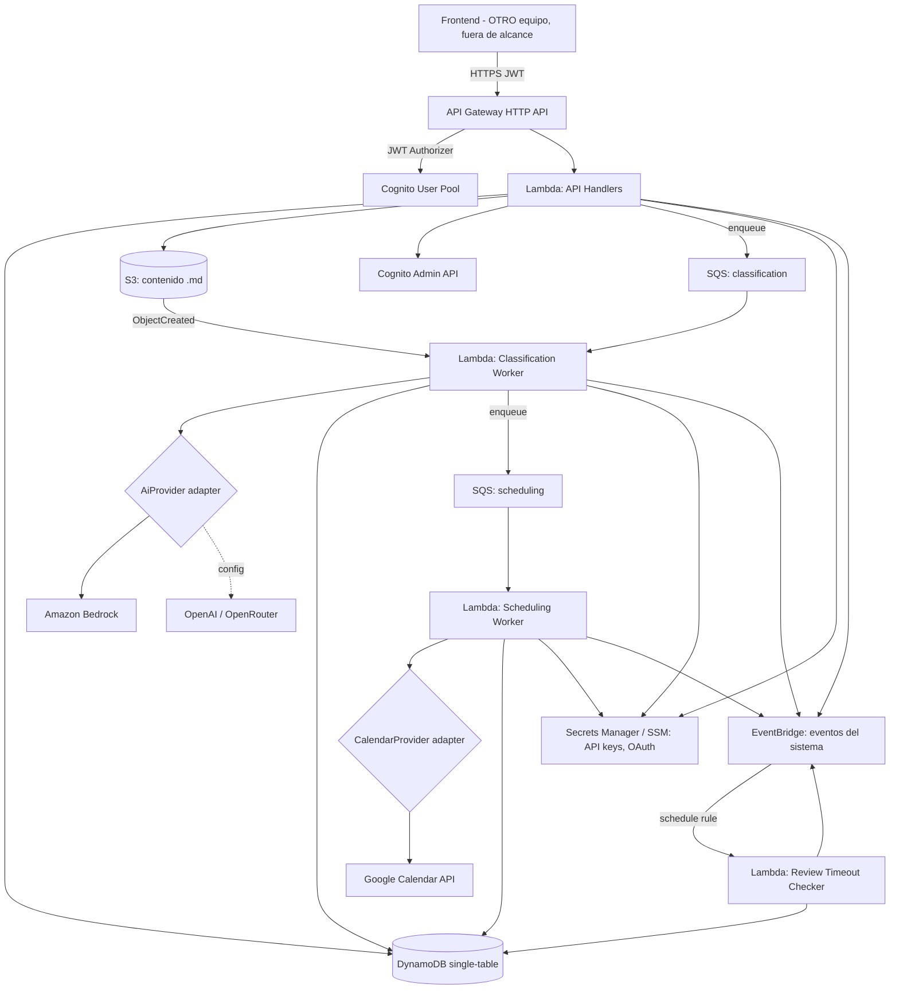
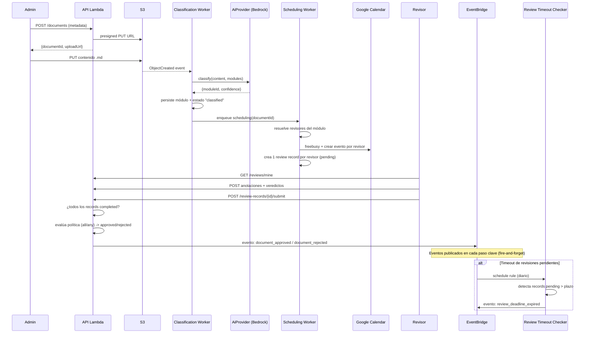

# Design Document

## Overview

Este diseño describe el **backend serverless** de un sistema de revisión de documentos Markdown sobre AWS. El sistema cubre: gestión administrativa (módulos, revisores, asignaciones con permiso lectura/edición), carga de documentos `.md` a S3, clasificación automática del módulo mediante IA (Amazon Bedrock por defecto, con adapter para OpenAI/OpenRouter), agendado automático de bloques de revisión en Google Calendar, registros de revisión independientes y paralelos con anotaciones y veredictos, y una política de aprobación configurable ("todos aprueban" / "al menos uno aprueba").

El alcance es **exclusivamente backend** y el frontend **queda fuera de esta sesión/spec**: se exponen endpoints HTTP claros (contrato + OpenAPI) para que otro equipo construya la UI por separado. Aquí no se diseña ni implementa interfaz de usuario. Las decisiones priorizan **serverless y bajo costo** porque el sistema se usará durante un evento acotado.

### Objetivos de diseño

- **Costo mínimo:** todo pago por uso (Lambda, API Gateway HTTP API, DynamoDB on-demand, S3, Bedrock on-demand). Cero recursos "always-on".
- **Desacoplamiento del proveedor de IA:** la clasificación depende de una interfaz, no de un proveedor concreto.
- **Procesamiento asíncrono:** la clasificación y el agendado se ejecutan fuera del request síncrono para no acoplar la UX a servicios externos lentos (Bedrock, Google).
- **Aislamiento de revisiones:** cada revisor trabaja sobre su propio registro; no hay estado compartido editable.
- **Claridad de contrato:** API versionada, errores uniformes, documentación OpenAPI (única superficie de integración para el equipo de frontend).

### Mapa de requisitos → diseño

| Requisito | Componente principal |
|---|---|
| R1 Módulos | `ModuleService` + endpoints `/modules` |
| R2 Revisores | `ReviewerService` + Cognito Admin API |
| R3 Asignaciones | `AssignmentService` + endpoints `/assignments` |
| R4 Carga de docs | `DocumentService` + S3 presigned URLs + evento S3 |
| R5 Clasificación IA | `ClassificationService` + `AiProvider` adapter (Bedrock/OpenAI/OpenRouter) |
| R6 Agendado | `SchedulingService` + `CalendarProvider` (Google Calendar) |
| R7 Registros paralelos | `ReviewRecordService` + modelo single-table |
| R8 Anotaciones/veredictos | `ReviewRecordService` (annotations, verdicts) |
| R9 Política aprobación | `ApprovalService` |
| R10 Auth multi-rol | Cognito + JWT authorizer + guards por módulo |
| R11 API clara | API Gateway HTTP API + OpenAPI + error model |
| R12 Serverless/costo | CDK stacks, DynamoDB on-demand, HTTP API |
| R13 Eventos del sistema | `EventPublisher` + EventBridge |

## Architecture

### Diagrama de componentes



> El nodo "Frontend" aparece solo para ubicar quién consume la API. **No se construye en esta sesión**; el único entregable hacia ese equipo es el contrato HTTP/OpenAPI.

### Flujo end-to-end (carga → aprobación)



### Estilo arquitectónico

- **API síncrona ligera:** los handlers de API hacen operaciones CRUD rápidas sobre DynamoDB/S3 y devuelven de inmediato. Las operaciones lentas (IA, Google) se delegan a workers vía SQS.
- **Workers asíncronos desacoplados por SQS:** da reintentos, DLQ y aísla fallos de servicios externos del request del usuario (satisface R5.7 y R6.6). SQS estándar es prácticamente gratis a volumen de evento.
- **Disparo de clasificación por evento S3:** cuando el contenido real llega a S3 (`ObjectCreated`) se dispara la clasificación, evitando clasificar documentos sin contenido confirmado (R4.6).

> Nota de costo: SQS + Lambda worker se elige frente a Step Functions para minimizar costo y complejidad en un uso de evento. Si se prefiere orquestación visible, Step Functions Express sería la alternativa, pero añade costo/estado innecesario para este alcance.

## Components and Interfaces

### Capas

```
handlers/        # Adaptadores HTTP (parse request, auth guard, map a service, map error->HTTP)
services/        # Lógica de negocio (ModuleService, ReviewerService, ... ApprovalService)
repositories/    # Acceso a DynamoDB (single-table), S3
providers/       # Adapters externos: AiProvider, CalendarProvider
events/          # EventPublisher: publicación fire-and-forget a EventBridge
domain/          # Entidades y tipos, invariantes, enums de estado
lib/             # utils: errores, logger, config, validación (zod)
```

### Interfaz `AiProvider` (adapter de IA)

```typescript
export interface ClassificationInput {
  content: string;
  modules: { id: string; name: string; description?: string }[];
}

export interface ClassificationResult {
  moduleId: string | null;   // null => no determinado con confianza
  confidence: number;        // 0..1
  rationale?: string;
}

export interface AiProvider {
  classifyDocument(input: ClassificationInput): Promise<ClassificationResult>;
}
```

Implementaciones: `BedrockAiProvider` (por defecto), `OpenAiProvider`, `OpenRouterAiProvider`. La selección se hace por configuración (`AI_PROVIDER` en SSM/env). Satisface R5.4 y R5.5. El umbral de confianza (`AI_CONFIDENCE_THRESHOLD`) decide si se marca `needs_manual_classification` (R5.3).

### Interfaz `CalendarProvider`

```typescript
export interface FreeBusyQuery {
  reviewerId: string;
  from: string;  // ISO
  to: string;    // ISO
}

export interface TimeSlot { start: string; end: string; }

export interface ScheduleRequest {
  reviewerId: string;
  slot: TimeSlot;
  summary: string;
  description: string;
}

export interface ScheduleResult {
  scheduled: boolean;
  externalEventId?: string;
  reason?: string;  // ej. "calendar_not_authorized"
}

export interface CalendarProvider {
  getBusy(q: FreeBusyQuery): Promise<TimeSlot[]>;
  schedule(req: ScheduleRequest): Promise<ScheduleResult>;
}
```

`GoogleCalendarProvider` implementa OAuth 2.0 por revisor (tokens en Secrets Manager). Si no hay autorización, devuelve `scheduled: false, reason: "calendar_not_authorized"` sin romper el flujo (R6.5). El sistema expone endpoints para vincular (`authorize-url` + `callback`) y desvincular (`DELETE /v1/integrations/google`) la cuenta de Google Calendar de un revisor (R6.8). El refresh token se almacena en Secrets Manager y se elimina al desvincular.

### `EventPublisher` (eventos del sistema)

```typescript
export interface SystemEvent {
  type: string;        // ej. "document.uploaded", "document.approved"
  resourceId: string;
  timestamp: string;   // ISO 8601
  actor?: string;      // userId si aplica
  detail?: Record<string, unknown>;
}

export interface EventPublisher {
  publish(event: SystemEvent): Promise<void>;
}
```

Implementación: `EventBridgePublisher` envía al bus por defecto de EventBridge con `source = "oli-docs"`. La publicación es fire-and-forget: si falla, se registra en logs sin bloquear la operación principal (R13.3, R13.4). Eventos publicados: `document.uploaded`, `document.classified`, `document.needs_manual_classification`, `review.scheduled`, `review_record.completed`, `document.approved`, `document.rejected`, `review.deadline_expired`.

### Servicios principales (contratos resumidos)

- `ModuleService`: `create`, `list`, `update`, `delete` (valida dependencias y nombres únicos → R1).
- `ReviewerService`: `create` (crea usuario Cognito con rol revisor), `list`, `deactivate` (R2).
- `AssignmentService`: `assign(reviewerId, moduleId, permission)`, `updatePermission`, `remove`, `listForReviewer` (R3). `permission ∈ {read, edit}`.
- `DocumentService`: `initUpload` (crea metadata + presigned URL), `confirmUpload`, `get`, `list`, `reassignModule` (R4, R5.6).
- `ClassificationService`: `classify(documentId)` (invocado por worker; usa `AiProvider`; aplica umbral; actualiza estado) (R5).
- `SchedulingService`: `scheduleFor(documentId)` (resuelve revisores, crea review records, agenda bloques) (R6, R7.1).
- `ReviewRecordService`: `listMine`, `get`, `addAnnotation`, `setSectionVerdict`, `setDocumentVerdict`, `submit`, `reopen(admin)` (R7, R8). Aplica guard de permiso edit/read y de propiedad del registro.
- `ApprovalService`: `evaluate(documentId)` (aplica política all/any cuando todos los records están completed) (R9). Soporta `forceEvaluate(documentId, excludedRecordIds, reason)` para que un admin fuerce la evaluación excluyendo records no enviados (R9.9).
- `ReviewTimeoutService`: `checkExpiredReviews()` (invocada por Lambda scheduled; detecta records `pending` que exceden el plazo configurable, publica evento `review.deadline_expired` por cada uno) (R9.9).
- `EventPublisher`: `publish(event)` (fire-and-forget a EventBridge; fallo → log, no bloquea) (R13).

### Guards de autorización

Un middleware común resuelve, a partir del JWT de Cognito:
- `requireAuth` → 401 si token inválido (R10.3).
- `requireRole('admin')` → 403 si falta rol (R10.4).
- `requireModuleAccess(documentId, 'edit' | 'read')` → verifica asignación y permiso del revisor sobre el módulo del documento (R3.6, R8.4, R10.5).
- `requireRecordOwner(recordId)` → el revisor sólo opera sobre sus propios registros (R7.4).

## Data Models

### Estrategia DynamoDB (single-table)

Una sola tabla `AppTable` con claves genéricas `PK`/`SK` y GSIs para accesos secundarios. On-demand (pay-per-request) por R12.2. Esto reduce costo y número de recursos frente a múltiples tablas.

| Entidad | PK | SK | Atributos clave |
|---|---|---|---|
| Module | `MODULE#<moduleId>` | `META` | name, createdAt |
| Reviewer | `USER#<userId>` | `META` | email, name, role, active |
| Assignment | `USER#<userId>` | `ASSIGN#<moduleId>` | permission (read\|edit) |
| Document | `DOC#<docId>` | `META` | name, s3Key, status, moduleId, classification{source,confidence}, approvalPolicy, approvalStatus, approvalDecidedAt |
| ReviewRecord | `DOC#<docId>` | `RECORD#<reviewerId>` | status, documentVerdict, scheduledEventId, scheduledSlot |
| Annotation | `RECORD#<docId>#<reviewerId>` | `ANNO#<annotationId>` | target{type,sectionId}, text, author, createdAt |
| SectionVerdict | `RECORD#<docId>#<reviewerId>` | `VERDICT#<sectionId>` | verdict (correct\|incorrect) |
| AuditLog | `AUDIT#<yyyy-mm-dd>` | `TS#<ts>#<id>` | actor, action, target, details |

**GSIs:**
- `GSI1` (byModule): `GSI1PK = MODULE#<moduleId>`, `GSI1SK = DOC#<docId>` → documentos por módulo (R6.1) y asignaciones por módulo.
- `GSI2` (byReviewer): `GSI2PK = USER#<reviewerId>`, `GSI2SK = RECORD#<docId>` → registros de revisión de un revisor (R7.3).

### Enums de estado

```typescript
type DocumentStatus =
  | 'pending_content'            // metadata creada, falta contenido en S3 (R4.6)
  | 'classifying'
  | 'classified'
  | 'needs_manual_classification'// R5.3
  | 'classification_failed'      // R5.7
  | 'in_review'
  | 'approved'                   // R9
  | 'rejected';

type ReviewRecordStatus = 'pending' | 'completed';     // R7.6, R8.6
type Permission = 'read' | 'edit';                      // R3
type Verdict = 'correct' | 'incorrect';                 // R8
type ApprovalPolicy = 'all' | 'any';                    // R9.1
```

### Entidades (tipos de dominio, resumen)

```typescript
interface Document {
  id: string;
  name: string;
  s3Key: string;
  status: DocumentStatus;
  moduleId?: string;
  classification?: { source: 'ai' | 'manual'; confidence?: number; };
  approvalPolicy: ApprovalPolicy;      // default configurable (R9.2)
  approvalStatus?: 'approved' | 'rejected';
  approvalDecidedAt?: string;
  createdAt: string;
}

interface ReviewRecord {
  documentId: string;
  reviewerId: string;
  status: ReviewRecordStatus;
  documentVerdict?: Verdict;           // requerido para submit (R8.7)
  scheduled: { done: boolean; eventId?: string; slot?: TimeSlot; reason?: string };
  createdAt: string;
  submittedAt?: string;
}
```

## API Design

API HTTP a través de **API Gateway HTTP API** (más barata que REST API, R11/R12). Versionada bajo `/v1`. Autenticación con **JWT authorizer** nativo contra el Cognito User Pool (sin Lambda authorizer para ahorrar costo e invocaciones). Esta API es la **única superficie de integración** con el frontend (que desarrolla otro equipo, fuera de alcance).

### Endpoints (resumen)

**Admin — módulos**
- `POST /v1/modules` · `GET /v1/modules` · `PATCH /v1/modules/{id}` · `DELETE /v1/modules/{id}`

**Admin — revisores y asignaciones**
- `POST /v1/reviewers` · `GET /v1/reviewers` · `POST /v1/reviewers/{id}/deactivate`
- `POST /v1/reviewers/{id}/assignments` (body: `{moduleId, permission}`)
- `PATCH /v1/reviewers/{id}/assignments/{moduleId}` · `DELETE /v1/reviewers/{id}/assignments/{moduleId}`

**Documentos**
- `POST /v1/documents` → `{documentId, uploadUrl}` (presigned PUT)
- `POST /v1/documents/{id}/confirm-upload`
- `GET /v1/documents` · `GET /v1/documents/{id}`
- `PATCH /v1/documents/{id}/module` (reclasificación manual admin, R5.6)
- `PATCH /v1/documents/{id}/approval-policy` (R9.1)

**Revisión (revisor)**
- `GET /v1/reviews/mine` → registros del revisor autenticado (R7.3)
- `GET /v1/review-records/{id}`
- `POST /v1/review-records/{id}/annotations`
- `PUT /v1/review-records/{id}/sections/{sectionId}/verdict`
- `PUT /v1/review-records/{id}/document-verdict`
- `POST /v1/review-records/{id}/submit` (R8.6)
- `POST /v1/review-records/{id}/reopen` (solo admin, R8.8)

**Calendar (OAuth revisor)**
- `GET /v1/integrations/google/authorize-url`
- `GET /v1/integrations/google/callback`
- `DELETE /v1/integrations/google` (desvincular calendario, R6.8)

**Admin — aprobación forzada**
- `POST /v1/documents/{id}/force-approval` (body: `{excludedRecordIds, reason}`, solo admin, R9.9)

### Modelo de error uniforme (R11.2)

```json
{
  "error": {
    "code": "VALIDATION_ERROR",
    "message": "permission must be 'read' or 'edit'",
    "details": [{ "field": "permission", "issue": "invalid_enum" }]
  }
}
```

Mapa de códigos: `VALIDATION_ERROR` (400), `UNAUTHENTICATED` (401), `FORBIDDEN` (403), `NOT_FOUND` (404), `CONFLICT` (409), `UPSTREAM_ERROR` (502/504 para fallos de IA/Google en rutas síncronas). Se publicará un **OpenAPI 3** como fuente de verdad del contrato (R11.3) — es el entregable de integración para el frontend.

## Workflows clave

### Clasificación (Classification Worker)

1. Trigger: evento S3 `ObjectCreated` (o mensaje SQS de reintento).
2. Carga contenido desde S3 y la lista de módulos.
3. Llama `AiProvider.classifyDocument`.
4. Si `confidence >= AI_CONFIDENCE_THRESHOLD` → set `moduleId`, status `classified`, `classification.source = 'ai'`. Si no → `needs_manual_classification`.
5. Publica evento `document.classified` o `document.needs_manual_classification` vía `EventPublisher`.
6. En éxito, encola mensaje de scheduling.
7. Fallos: reintentos de SQS; agotados → DLQ y status `classification_failed` (R5.7).

### Agendado (Scheduling Worker)

1. Trigger: mensaje SQS `scheduling(documentId)`.
2. Resuelve revisores del módulo vía `GSI1`/asignaciones.
3. Crea un `ReviewRecord` por revisor en `pending` (R7.1).
4. Calcula duración estimada: `max(MIN, ceil(words / WORDS_PER_MIN))` acotada por config (R6.4).
5. Por revisor: `getBusy` en ventana configurada → primer hueco libre sin solape (R6.7) → `schedule`.
6. Guarda `scheduled.eventId/slot` o `scheduled.done=false, reason` (R6.5/6.6).
7. Publica evento `review.scheduled` por cada registro creado vía `EventPublisher`.

### Aprobación (ApprovalService)

- Se evalúa tras cada `submit`. Si todos los records del documento están `completed`:
  - `all`: approved si todos `documentVerdict === 'correct'`; si alguno `incorrect` → rejected.
  - `any`: approved si alguno `correct`; si todos `incorrect` → rejected.
- Persiste `approvalStatus`, `approvalDecidedAt`, política aplicada; registra auditoría (R9.8).
- Publica evento `document.approved` o `document.rejected` vía `EventPublisher`.
- **Forzar evaluación (admin):** `forceEvaluate(documentId, excludedRecordIds, reason)` permite evaluar excluyendo records `pending` vencidos. Persiste qué records se excluyeron y la razón (R9.9).

### Review Timeout Checker

1. Trigger: EventBridge scheduled rule (diario, configurable).
2. Escanea la tabla buscando `ReviewRecord` en estado `pending` cuya antigüedad excede `REVIEW_TIMEOUT_DAYS` (default 7).
3. Por cada record vencido: publica evento `review.deadline_expired` (con `documentId`, `reviewerId`, días vencido).
4. No cambia estado automáticamente — la acción la toma el admin vía `POST /v1/documents/{id}/force-approval` o manualmente.

## Error Handling

- **Validación de entrada:** `zod` en el borde de cada handler → `VALIDATION_ERROR` (400). Valida extensión `.md` y tamaño máximo configurable (default 5 MB) en `initUpload`/`confirm` (R4.2).
- **Autorización:** guards devuelven 401/403 antes de tocar la lógica (R10).
- **Idempotencia:** `confirm-upload`, `submit` y los workers son idempotentes (claves condicionales en DynamoDB `attribute_not_exists`/estado esperado) para tolerar reintentos de SQS.
- **Servicios externos (IA/Google):** encapsulados en providers con timeout, reintentos con backoff y límite de intentos (R5.7, R6.6, R12.6). Fallos no bloquean el flujo principal: degradan el estado del documento o del agendado.
- **DLQ + alarmas mínimas:** colas con DLQ; una alarma básica de CloudWatch por profundidad de DLQ (bajo costo) para visibilidad en el evento.
- **Logging estructurado:** JSON con `requestId`, `actor`, `action`. Auditoría de operaciones sensibles en la tabla (R10.6).

## Testing Strategy

- **Unit (prioridad):** servicios de dominio con repos y providers mockeados. Casos clave: política de aprobación all/any (R9.4–9.7), guards de permiso read/edit (R3.6, R8.4), reglas de submit (R8.7), selección de hueco sin solape (R6.7), umbral de confianza de clasificación (R5.3).
- **Contratos de providers:** tests con dobles para `AiProvider` y `CalendarProvider`; un `FakeAiProvider` determinista para pruebas sin costo de Bedrock.
- **Integración (local):** DynamoDB Local + handlers; validación de accesos single-table y GSIs.
- **Validación de API:** pruebas contra el esquema OpenAPI (request/response) para asegurar el contrato del frontend (R11).
- **E2E ligero (opcional, pre-evento):** flujo carga → clasificación (fake) → scheduling (fake) → revisión → aprobación, sin llamar servicios externos reales.

## Infraestructura (AWS CDK, TypeScript)

Organización en stacks para despliegue incremental y bajo costo:

- **`DataStack`:** DynamoDB `AppTable` (on-demand, GSIs), bucket S3 de documentos (bloqueo público, cifrado SSE-S3), colas SQS (classification, scheduling) + DLQs.
- **`AuthStack`:** Cognito User Pool + App Client, grupos `admin`/`revisor`, dominio hosted UI opcional.
- **`ApiStack`:** HTTP API + JWT authorizer, Lambdas de API (bundling con esbuild, arm64 para menor costo), rutas e integraciones.
- **`WorkersStack`:** Lambdas de clasificación y agendado, triggers S3→SQS→Lambda, permisos a Bedrock, acceso a Secrets Manager/SSM.
- **`EventsStack`:** EventBridge bus (default), regla scheduled para Review Timeout Checker Lambda (diaria), permisos `events:PutEvents` para las Lambdas de API y workers. Sin consumidores predefinidos — los equipos de integración conectan sus targets (R13).
- **Config/secretos:** SSM Parameter Store para config no sensible (`AI_PROVIDER`, umbrales, ventana de agendado, `REVIEW_TIMEOUT_DAYS`); Secrets Manager para API keys (OpenAI/OpenRouter) y tokens OAuth de Google.

Decisiones de costo: Lambda **arm64** + memoria ajustada, **HTTP API** en vez de REST, DynamoDB **on-demand**, **S3** estándar, Bedrock **on-demand** (sin provisioned throughput), SQS estándar, **EventBridge** (prácticamente gratis a bajo volumen). Sin NAT Gateway (Lambdas fuera de VPC; acceso a AWS por endpoints públicos del SDK) para evitar el costo fijo del NAT.

## Fuera de alcance (esta sesión)

- Frontend / UI web (lo construye otro equipo); aquí solo se entrega la API y su OpenAPI.
- Pipelines CI/CD, dominios personalizados y certificados.
- Observabilidad avanzada (dashboards, tracing distribuido) más allá de logs estructurados y una alarma de DLQ.

## Decisiones y trade-offs

- **SQS + Lambda vs Step Functions:** se elige SQS+Lambda por costo/simplicidad para un evento. Trade-off: menor visibilidad de orquestación.
- **Single-table DynamoDB:** menos recursos y costo, accesos eficientes vía GSIs. Trade-off: modelado más estricto; mitigado documentando los patrones de acceso.
- **JWT authorizer nativo vs Lambda authorizer:** nativo evita invocaciones extra (costo) y latencia; los permisos finos por módulo se resuelven en la capa de servicio con las asignaciones.
- **OAuth de Google por revisor:** necesario para `freebusy` y creación de eventos en el calendario personal; si un revisor no autoriza, el flujo continúa marcando "no agendado" (R6.5).
- **Clasificación disparada por S3 ObjectCreated:** garantiza que sólo se clasifica contenido realmente subido (R4.6), a cambio de un pequeño acoplamiento a eventos de S3.
- **EventBridge vs SNS para eventos del sistema:** se elige EventBridge por su enrutamiento por patrones y bajo costo a volumen de evento, permitiendo que integraciones futuras se conecten sin tocar la lógica de negocio (R13). Trade-off: un bus más que mantener; mitigado al usar el bus por defecto.
- **Validación por extensión `.md` (no "Markdown válido"):** casi cualquier texto es Markdown válido, así que validar la estructura aporta poco. Se valida extensión + tamaño; la calidad del contenido la evalúa la IA en la clasificación (R4.2).
- **Timeout de revisiones sin acción automática:** el checker sólo notifica (evento) y deja la decisión al admin (`force-approval`), evitando aprobar/rechazar documentos por inacción de un revisor sin supervisión humana (R9.9).
